# 🛡️ AI OPS FIELD NOTES

> **The battle-tested operational playbook for monitoring, evaluating, hardening, and troubleshooting production LLM pipelines and autonomous AI systems.**

[](https://iggym.github.io/ai-ops-field-notes)
[](https://github.com/iggym/ai-ops-field-notes)
[](https://iggym.github.io/ai-ops-field-notes)

---

## ⚡ THE NARRATIVE: FROM DEPLOYMENT TO BATTLE-TESTED AI RELIABILITY

```mermaid
flowchart LR
    subgraph S1["👁️ 1. TRACING & SPANS"]
        A1["Token Telemetry"]
        A2["Latency Percentiles"]
        A3["Span Attribution"]
    end

    subgraph S2["🛡️ 2. GUARDRAILS"]
        B1["Injection Filtering"]
        B2["PII Sanitization"]
        B3["Schema Enforcement"]
    end

    subgraph S3["📊 3. EVAL LOOPS"]
        C1["LLM-as-a-Judge"]
        C2["Hallucination Scoring"]
        C3["Semantic Drift Audit"]
    end

    subgraph S4["🚨 4. RECOVERY"]
        D1["Model Fallbacks"]
        D2["Circuit Breakers"]
        D3["Graceful Degradation"]
    end

    S1 --> S2 --> S3 --> S4
```



---

## 📟 WHAT THIS REPO IS

**AI Ops Field Notes** is the incident-dispatch layer of a portfolio on running AI in production: short, war-story-shaped dispatches (about a 3-minute read) about AI systems that failed while every dashboard stayed green. Each dispatch is one self-contained HTML page with a single interactive moment that makes the failure visible.

- **Live site:** <https://iggym.github.io/ai-ops-field-notes/>
- **Audience:** practitioners and on-call engineers

## 🗂️ REPO LAYOUT

| Path | What it is |
|---|---|
| `index.html` | Homepage feed. Renders every `published` entry in `metadata.json`. |
| `metadata.json` | Site config and the article index (the source of truth for the feed). |
| `articles/<slug>.html` | One self-contained dispatch per file. |
| `docs/master-prompt-v1.md` | The master prompt used to generate new dispatches, including the house HTML template. |
| `tasks/tasks.md` | Prioritized backlog of site and repo improvements. |
| `scripts/validate.py` | Checks `metadata.json` against the article files. Run it before every PR. |

## ✍️ ADDING A DISPATCH

1. Generate the article and its metadata entry with [`docs/master-prompt-v1.md`](docs/master-prompt-v1.md).
2. Save the HTML as `articles/<slug>.html` and append the JSON entry to `metadata.json` → `articles[]`.
3. Run `python3 scripts/validate.py`.
4. Preview locally with `python3 -m http.server` and open <http://localhost:8000>.

### Metadata entry schema

```json
{
  "id": "NNNN",
  "slug": "kebab-case-slug",
  "title": "Title",
  "hook": "One-sentence hook, under 30 words.",
  "path": "articles/kebab-case-slug.html",
  "date": "YYYY-MM-DD",
  "status": "published",
  "format": "dispatch",
  "tags": ["failure-class", "mechanism", "domain"],
  "reading_time_minutes": 3,
  "pinned": false,
  "research_window": "YYYY-MM-DD to YYYY-MM-DD",
  "source_type": "composite | single-source-anonymized | public-postmortem"
}
```

## 📜 LICENSE

See [LICENSE](LICENSE).
